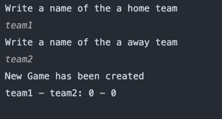

# ScoreBoard

### How to run
install Java 17

### How to use
After application running the menu is shown

You need to choose option by enter the appropriate number + ENTER

### 1. Start Game
**Write names of home and away teams**

### 2. Finish Game
**Choose the game which should be finished and removed from the board**

### 3. Update Score
**Choose the game which should be updated**

### 4. Get a summary of games by total score
**Print match results by score**

